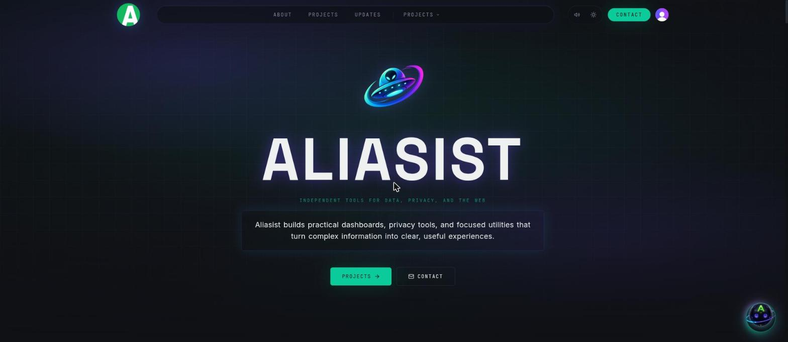
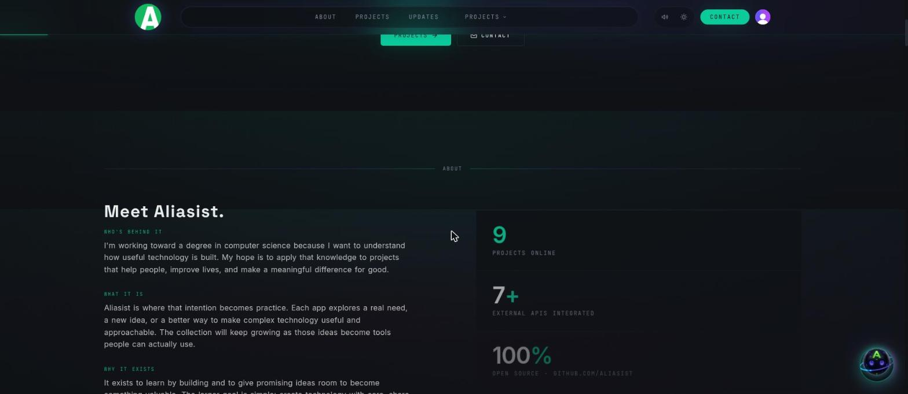

# Aliasist

**Aliasist** is my homepage — the front door to everything else I've built. One stop to see the whole suite and get pointed at whatever you're after.

## What it actually looks like

## The suite

- **DataSist** — data and insight dashboards
- **PulseSist** — market signal dashboards
- **EcoSist** — environmental observatory tools
- **SpaceSist** — orbital mission planning
- **Clearasist** — privacy-first, fully local metadata stripping. Runs client-side only; the only thing it ever shows you is a removal count.
- **Aliasist Tech · Waterfall** — a protected workspace for prompts, chat, and private sessions

## Tech stack

- React + Vite + TypeScript
- Tailwind CSS + Radix UI
- Cloudflare Pages + Functions (Wrangler)
- Clerk authentication

## Repository structure

- `src/` — homepage UI and routing
- `public/` — static assets and brand imagery
- `functions/` — Cloudflare Pages Functions
- `apps/` — suite applications and experiments
- `assets/` — marketing visuals

## Local development

### Quickstart

- Install: `npm install`
- Set local Pages/Clerk vars: `cp .dev.vars.example .dev.vars` then fill keys
- Run: `npm run dev` (Vite on `http://localhost:8080`)
- Health check: `npm run doctor`

### Useful commands

- `npm run dev` — homepage dev server (port 8080)
- `npm run preview` — production-like: build + `wrangler pages dev dist`
- `npm test` — unit tests
- `npm run lint` — ESLint

### Apps

Suite apps live in `apps/*` and can be run from the repo root:

- `npm run app:datasist`
- `npm run app:pulsesist`
- `npm run app:spacesist`

## Environment variables

- `.dev.vars` — local Pages Functions + Clerk keys (copy from `.dev.vars.example`)
- `.env.local` — local Vite vars (copy from `.env.example`)
- Agent dashboard snapshot reads require `ALIASIST_ADMIN_USER_IDS` and the server-only `AGENT_PUSH_SECRET`.

## Deployment

Production deploys use Cloudflare Pages and Wrangler. Run `npm run build` then `npm run deploy`.

## Contributing

See [CONTRIBUTING.md](CONTRIBUTING.md) for setup, checks, and PR guidelines.

## Security

Please report vulnerabilities via GitHub Security Advisories. See [SECURITY.md](SECURITY.md).

## License

This repository is proprietary. See [LICENSE](LICENSE).
